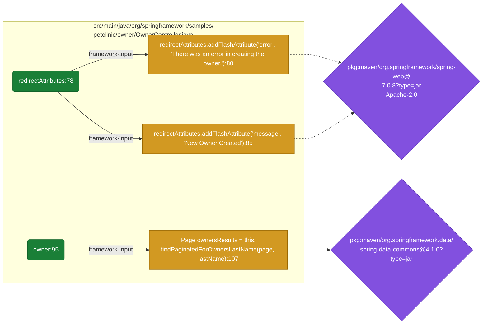

# atom-tools

Collection of tools for post-processing the reports of the AppThreat analysis
ecosystem: [atom](https://github.com/appthreat/atom) slices (Java, JavaScript,
Python, Ruby, ...), dosai (.NET), golem (Go), rusi (Rust) and kosi (Kotlin/JVM)
flow reports. The six analysis commands — `ingest`, `attack-surface`, `drift`,
`graph`, `explain` and `crypto-reach` — accept any of the five, mixed freely.

## Install the engines

atom-tools reads reports; it never runs an engine. Generating them is the user's
or CI's job, a deliberate scope decision: reading reports from disk keeps three
more toolchains and their failure modes out of atom-tools' support surface. The
atom documentation lives in
the [AppThreat/atom](https://github.com/AppThreat/atom?tab=readme-ov-file) GitHub repository.

Atom installs from a
[native image](https://github.com/AppThreat/atom#atom-native-image-advanced-users-only) or with
npm `npm install -g @appthreat/atom`. The golem and rusi binaries are published in the
[cdxgen-plugins-bin](https://github.com/cdxgen/cdxgen-plugins-bin/releases) releases (and bundled
in the atom-tools Docker image); dosai builds from [OWASP/dosai](https://github.com/OWASP/dosai)
with `dotnet`. kosi ships from the `thirdparty/kosi` directory of cdxgen-plugins-bin — it is
pre-1.0 and currently built for darwin-arm64 only, so CI environments cannot run it; generate
kosi reports on a Mac and commit or pass the JSON along like any other report.

## Install atom-tools

`pip install atom-tools`

## Docker image

A prebuilt image with atom-tools, atom, blint, and the companion analyzers is published
at `ghcr.io/appthreat/atom-tools`.

```
docker run --rm -it -v /tmp:/tmp -v $(pwd):/app:rw -w /app ghcr.io/appthreat/atom-tools
```

The image bundles the `rusi` and `golem` analyzer binaries from
the [cdxgen-plugins-bin](https://github.com/cdxgen/cdxgen-plugins-bin/releases) releases. `rusi`
discovers the api endpoints of Rust projects and `golem` does the same for Go projects. Their
reports can be passed straight to the convert command with `-t rust` or `-t go`.

During the image build, the binary for the target platform (amd64 or arm64) is downloaded from the
GitHub release and checked against the published sha256 checksum before it is installed. A
corrupted or replaced download fails the build instead of shipping quietly. Override the
`CDXGEN_PLUGINS_BIN_VERSION` build argument to bundle a different release.

Generate a Rust report inside the container:

```
docker run --rm -v $(pwd):/app -w /app --entrypoint rusi ghcr.io/appthreat/atom-tools analyze --dir . --out rusi.json
```

Generate a Go report:

```
docker run --rm -v $(pwd):/app -w /app --entrypoint golem ghcr.io/appthreat/atom-tools analyze --dir . --out golem.json
```

Convert either report into an OpenAPI document:

```
docker run --rm -v $(pwd):/app -w /app ghcr.io/appthreat/atom-tools convert -i rusi.json -t rust -f openapi3.0.1 -o openapi.json
```

Since the image bundles atom itself, the analyze command works out of the box to slice a
mounted source tree and post-process the results:

```
docker run --rm -v $(pwd):/app -w /app ghcr.io/appthreat/atom-tools analyze -l java -i . -o reports --sarif
```

## CLI usage

The command line interface is built with cleo, the library that also powers Poetry, so it follows
the same conventions.

Run `atom-tools list` to see every available command. Run `atom-tools help` followed by a command
name, for example `atom-tools help convert`, to see the options of that command.

```
Usage:
  command [options] [arguments]

Options:
  -h, --help            Display help for the given command. When no command is given display help for the list command.
  -q, --quiet           Do not output any message.
  -V, --version         Display this application version.
      --ansi            Force ANSI output.
      --no-ansi         Disable ANSI output.
  -n, --no-interaction  Do not ask any interactive question.
  -v|vv|vvv, --verbose  Increase the verbosity of messages: 1 for normal output, 2 for more verbose output and 3 for debug.

Available commands:
  analyze          Analyse a source tree with atom and post-process the slices (merge, stats, OpenAPI, SARIF).
  apk-analysis     Analyse Android apps (apk/apkm/aab) using blint and atom.
  attack-surface   Group entry points by exposure tier and report what each reaches (dosai's AttackSurface view, for every engine).
  check-reachable  Find out if there are hits for a given package:version or file:linenumber in an atom slice.
  convert          Convert an atom slice to a different format.
  crypto-reach     Join crypto inventory (weak algorithms, key material, findings) to entry-point reachability, per engine, at the granularity each engine's evidence supports.
  drift            Compare two reachability reports from the same engine and report the risk delta between them (added, removed and moved flows).
  explain          Explain flows in words: deterministic, template-driven narratives over any engine report or unified document (text, markdown or agent JSON).
  filter           Filter an atom slice based on specified criteria.
  graph            Compute a call-graph metric — chokepoints, centrality, blast radius, entry depth, dead-code or cycles — over engine call graphs.
  help             Displays help for a command.
  ingest           Normalise dosai, golem, rusi, kosi or atom flow reports into the unified flow model (or an atom-compatible reachables document).
  list             Lists commands.
  merge-slices     Merge reachable slice files (including atom's chunked output) into a single de-duplicated slice.
  query-endpoints  List elements to display in the console.
  stats            Summarise an atom slice: counts, source files, packages (purls) and tags.
  validate-lines   Check the accuracy of the line numbers in an atom slice.
  visualize        Visualise reachable slices: rich console report plus a mermaid.js flowchart and an HTML page.
```

## Features

### Analyze

The analyze command drives the atom CLI for any language atom supports and then post-processes
the artefacts with atom-tools itself. It runs `atom reachables` first and reuses the produced
atom for `atom usages`, merges atom's chunked reachables files, computes slice statistics, and
optionally extracts an OpenAPI document and writes a SARIF report.

Use it to drive atom the same way apk-analysis does for Android apps, but for source trees:
`--extract-endpoints` for the OpenAPI document, `--sarif` for IDE/code-scanning integration,
and `--no-usages` when only reachables are needed.

**Example**

> `atom-tools analyze -l python -i . -o reports --sarif`

### APK analysis

The apk-analysis command analyses an Android application from end to end by driving blint and atom
as subprocesses and presenting a consolidated report. It accepts a single apk, apkm, or aab file, or
a directory containing them. blint generates the CycloneDX SBOM and atom generates the usage and
reachable slices. atom-tools then merges the two views.

blint runs in deep mode by default so the dex classes are parsed. This is what enables service and
tracker detection and the Dalvik behavioural review. atom-tools reads the behavioural findings back
from the BOM and presents them as static behaviours, and it promotes the services that atom proves
reachable into the SBOM with their observed data flow direction and flow counts. A single blint
invocation with disassembly enabled produces both the BOM and the Dalvik callgraph sidecar, so there
is no need for a second run.

Use `--no-deep` to skip dex parsing, `--skip-atom` to generate only the SBOM, `--blint-venv` to
point at a blint installed in its own virtual environment, and `--format json` to write a
consolidated analysis document instead of rendering tables.

For the custom properties that the analysis reads from and writes to the BOM, see the
[blint Custom Properties documentation](https://github.com/owasp-dep-scan/blint/blob/main/docs/CUSTOM_PROPERTIES.md).

**Example**

> `atom-tools apk-analysis -i /path/to/app.apkm -o reports`

### Ingest

The ingest command normalises flow reports from the five ecosystem engines — atom reachables, dosai
dataflows/methods, golem analyze, rusi analyze, kosi analyze — into one unified flow model. Engines
are detected from the report envelope and can be mixed freely in one invocation; every flow carries
the engine's own severity where it emits one (taxonomy-derived otherwise), a truncated-witness
flag, and its raw engine record as an escape hatch.

**Example** (the committed golem fixture, from a clone of this repository):

> `atom-tools ingest -i test/data/ecosystem/go-ipsw-golem.json -o unified-flows.json`

- `--emit unified` (the default) writes the model document; `--emit reachables` writes an
  atom-compatible document that `stats`, `visualize`, `convert -f sarif`, `check-reachable` and
  `filter` already consume — so the existing commands work on dosai, golem, rusi and kosi reports
  unchanged.
- A unified document can be read back in: every report-taking command (`stats`, `explain`,
  `attack-surface`, `drift`, ...) accepts it, so a polyglot repository can be ingested once and
  reviewed with any of them.

### Attack surface

The attack-surface command groups a report's entry points by exposure tier — anonymous-http,
anonymous-rpc, anonymous, mcp, queue, cli, authenticated-http, authenticated-rpc, internal — and
reports what each one reaches, in the shape of dosai's own `AttackSurface[]` view, for every engine.

**Example**

> `atom-tools attack-surface -i test/data/ecosystem/dotnet-eshoponweb-dosai-dataflows.json`

- **dosai classifies authentication and kosi carries declared requirements.** dosai's verdict is
  used verbatim, never re-derived. kosi maps `apiEndpoints[].authentication` — a non-empty list
  lifts the endpoint to `authenticated-http`, a `security-constraint(denied)` deny rule and an
  `exported: false` manifest map to `internal` — and stops there: an **empty declaration is not a
  denial**, so kosi endpoints without a declared requirement stay in `unknown-auth`, exactly like
  every other non-dosai engine, and "anonymous" is never asserted for anything that did not say so.
- For golem, rusi and kosi, reach is computed by anchoring each endpoint's handler in the engine's
  call graph and attaching the flows whose source function falls inside its transitive closure.
  kosi endpoints that name their own slices (`apiEndpoints[].sliceIds`) carry the engine's verdict
  directly instead — the one flow link in the ecosystem besides dosai's.
  Endpoints that cannot be anchored report `seed-not-found`; endpoints with no call graph report
  reach as `not computed` — "reaches nothing" and "not computed" are opposite findings and always
  render differently.
- **An endpoint whose handler was never read says so.** kosi flags a declared route it read no
  code behind (`apiEndpoints[].substantiated: false` — an Android manifest naming a class that is
  not in the tree). It stays in the surface, because it is a real declared entry point, and it is
  marked `declared only — handler code not read`; its reach line says zero flows there mean
  unexamined, not clean. Dropping it would hide an entry point and publishing it unmarked would
  present an unexamined route as a clean one.
- `-f json` carries every entry point (the console and `-f html` renderings are bounded by
  `--max-entries`); `-f html` writes a mermaid diagram and a single-file page.

### Drift

The drift command compares two runs of the same engine and reports the risk delta between them:
flows added, removed or merely moved, newly reachable packages, new entry points. It is a pure
function over two reports — it never invokes an engine, so it runs in seconds in CI.

**Example**

> `atom-tools drift --old test/data/ecosystem/go-ipsw-golem-baseline.json --new test/data/ecosystem/go-ipsw-golem.json`

- Flow identity is built from **analysis facts only** — source and sink category, sink symbol,
  root-relative file, purls — and deliberately excludes line numbers, column numbers and engine
  node ids, all of which move on every edit. A flow whose location changed but whose identity did
  not is reported as moved, not as added plus removed (on the fixture pair above: +159 added,
  -105 removed, ~91 moved across ~400 commits).
- `--fail-on` takes comma-separated gate keys (`new-high`, `new-medium`, `new-anonymous-endpoint`,
  `new-package`, `new-sink-category`, `new-entrypoint`); when any trips, the command exits with
  code **2**. A coverage regression — the new run analysed materially fewer files, or the engine
  reported the run as truncated — trips the gate regardless of `--fail-on`: a half-broken build
  must not render as a green diff.

### Graph

The graph command reads the call graph five engines emit — golem `callGraph`, rusi `call_graph`,
kosi `callGraph` (with its reachability-from-root-scopes verdicts), dosai `CallGraph`+`Reachability`
(methods report), atom `export --format graphml` — and computes one metric over it: chokepoints
(nodes on the most source→sink paths, the default), centrality, blast radius, entry depth, dead-code
or recursion clusters.

**Example**

> `atom-tools graph -i test/data/ecosystem/go-ipsw-golem.json --metric dead-code`

- A metric is computed **within the committed subgraph**, and the output says so: the golem
  fixture's call graph is 3,325 of the run's 22,308 edges, so every number describes that slice.
- **Dead-code is the engine's verdict, never a deletion claim.** golem's "unreachable from roots"
  is relative to the root set golem was given. The committed pair demonstrates it:
  `go-ipsw-golem.json` and `go-ipsw-golem-roots.json` are the same call graph (986 nodes, 3,325
  edges) from the same target, differing only in the root set — 186 roots (`init` 184, `main` 2)
  leave 984 of 986 nodes unreachable; 3,459 roots (`exported` 3,457, `main` 2) leave 39. Same
  code, opposite verdicts; the root set is the difference:

> `atom-tools graph -i test/data/ecosystem/go-ipsw-golem-roots.json --metric dead-code`

- Two traps recorded in that pair: passing `--roots` **replaces** golem's default root set (the
  second fixture has no `init` roots at all), and `--roots handlers` contributed **zero** roots on
  this target — golem's handler detection only recognises the net/http signature, and ipsw uses
  gin.
- Where the engine already computes a metric (dosai's fanIn/fanOut and DepthFromEntryPoint, golem's
  reachableFromRoots, atom's own centrality/scc joined via `--algorithms`), the engine's value is
  used verbatim with its provenance labeled; recomputed values say so.

### Explain

The explain command renders a report's flows as deterministic, citable sentences — for a reviewer
or for an agent. **No LLM**: the narrative is template-driven, so the same input produces the same
sentences and is safe to diff in CI. Every clause maps to a field in the unified flow model, and
where a field is empty the clause is omitted or hedged, never filled with a plausible default.

**Example**

> `atom-tools explain -i test/data/ecosystem/rust-microservices-kafka-rusi.json`

- The honesty clauses are part of the output: dosai classifies authentication outright and kosi
  carries declared requirements (every other engine's routes — and kosi's undeclared ones — say the
  exposure is unknown); the endpoint→flow join is partial and an unjoined flow says so; atom slices
  record no version, so none is printed; the sanitizer sentence appears only for engines whose
  schema carries a sanitizer field.
- `--flow`, `--package`, `--file` and `--query` (dosai's compact grammar, e.g.
  `flows[sink_category=sql && severity=error]`) select flows for the text and markdown formats.
- `-f agent` emits a compact, token-budgeted JSON context for a consuming agent, trimmed with an
  unmissable `truncated: N more` marker. The budget is an **estimate** (characters/4), not a real
  tokeniser, and the document says so.
- `--mcp` starts a read-only stdio MCP server over the loaded report (requires the
  `mcp` extra), exposing `atom.explain_flow`, `atom.attack_surface`, `atom.drift`,
  `atom.graph_hotspots` and `atom.query`.

### Crypto reach

The crypto-reach command joins a report's crypto inventory to entry-point reachability — the
question a CBOM cannot answer: is this weak algorithm on a path an entry point reaches?

**Example**

> `atom-tools crypto-reach -i test/data/ecosystem/dotnet-eshoponweb-dosai-crypto.json`

- The join runs per engine at **the granularity each engine's evidence supports**, and every
  rendering states which one it is using: dosai is record-level (the engine's own
  `ReachableFromEntryPoint` verdicts, rendered verbatim); rusi is function-level for materials
  (anchored in the call graph) and package-level for libraries; golem is package-level at best —
  its crypto items carry no enclosing-function field, so the claim printed is "this site sits in a
  package that carries tainted flows", never "this call is on a tainted path"; kosi splits by
  record kind — operations carry an enclosing function and join at function grain, materials and
  findings carry only a file position and join at file grain, and assets, protocols and libraries
  carry no location at all and are rendered as inventory only.
- There is **deliberately no cross-engine total**: four granularities do not sum, and counts are
  per engine.
- atom slices and unified documents carry no crypto section; both are reported as out of scope
  rather than producing an empty report.

### Convert

The convert command turns an atom slice into a different format. It builds the endpoints of an
OpenAPI 3.x paths object from a usages slice, or a SARIF 2.1.0 document from a reachable slice.
The api discovery reports produced by the rusi (Rust) and golem (Go) analyzers are accepted as
input as well, using `-t rust` and `-t go`. Future releases will fill the path item objects
with more detail taken from atom slices.

```
Description:
  Convert an atom slice to a different format

Usage:
  convert [options]

Options:
  -f, --format=FORMAT                    Destination format [default: "openapi3.1.0"]
  -i, --input-slice=INPUT-SLICE          Usages slice file [default: "usages.slices.json"]
  -e, --semantics-slice=SEMANTICS-SLICE  Semantics slice file [default: "semantics.slices.json"]
  -t, --type=TYPE                        Origin type of source on which the atom slice was generated. [default: "java"]
  -o, --output-file=OUTPUT-FILE          Output file [default: "openapi.json"]
  -s, --server=SERVER                    The server url to be included in the server object.
  -h, --help                             Display help for the given command. When no command is given display help for the list command.
  -q, --quiet                            Do not output any message.
  -V, --version                          Display this application version.
      --ansi                             Force ANSI output.
      --no-ansi                          Disable ANSI output.
  -n, --no-interaction                   Do not ask any interactive question.
  -v|vv|vvv, --verbose                   Increase the verbosity of messages: 1 for normal output, 2 for more verbose output and 3 for debug.

Help:
  The convert command converts an atom slice to a different format.
  Currently supports creating an OpenAPI 3.x document based on a usages slice.
```

**Example**

> `atom-tools convert -i usages.slices.json -f openapi3.0.1 -o openapi_usages.json -t java -s https://myserver.com`

#### SARIF

Pass `-f sarif` to convert a reachable slice into a
[SARIF 2.1.0](https://docs.oasis-open.org/sarif/sarif/v2.1.0/sarif-v2.1.0.html) document. Every
reachable flow group becomes a result: the terminal (sink) node is the primary location, the
whole source-to-sink path is preserved as a code flow, and the atom tags (`sql`, `ssrf`, `pii`,
`tracker`, ...) drive the rule id (`atom:sql`, `atom:ssrf`, ...) and the level (`error` for
high risk sinks, `warning` for other tagged flows, `note` otherwise). Package purls are recorded
in the result properties, and stable partial fingerprints make the report suitable for GitHub
code scanning uploads. The SARIF format composes with the [filter](#filter) command, and the
output loads into the same viewers that display dep-scan and blint reports.

> `atom-tools convert -i reachables.slices.json -f sarif -o reachables.sarif`

Like every command that consumes reachables, convert understands atom's chunked output
(`reachables.json`, `reachables_1.json`, ...) and globs: `-i 'reachables*.json'` loads all
chunks at once.

### Merge slices

atom chunks large reachable slices into `reachables.json`, `reachables_1.json`, ... (1000 flow
groups per file, written as bare JSON arrays), and polyglot projects produce one slice per
language. The merge-slices command folds any number of them into a single de-duplicated
`{"reachables": [...]}` document that every other atom-tools command accepts. Flow groups
identical across input files are dropped; entries repeated within one file keep their
historical counts.

> `atom-tools merge-slices -i 'reachables*.json' -o merged.reachables.slices.json`

Use `--no-dedupe` to keep every flow group. Sibling chunks of each input file are picked up
automatically, so passing the first chunk of each run is enough.

### Stats

The stats command summarises any slice type for quick triage: flow group, node and source file
counts for reachables, object slices and external/internal call counts for usages, node/edge/path
counts for data-flow slices, and module counts for parsedeps slices. Reachable package purls and
the most common tags (sources, sinks, pii, tracker, ...) are listed with their frequencies.

> `atom-tools stats -i reachables.slices.json`

Use `--json` (with `-o`) for a machine-readable summary in CI.

### Visualize

The visualize command turns a reachable slice into pictures you can actually share: a rich
console report and a [mermaid.js](https://mermaid.js.org) flowchart, written as a `.mmd` file
and as a single-file HTML page that renders it (mermaid.js loaded from the CDN, so viewing needs
internet access; pass `--mermaid-source` with a local `mermaid.min.js` to embed the renderer for
offline use).

> `atom-tools visualize -i reachables.slices.json -b sbom.json -o flows`

- the console report shows an overview panel, a per-file tree of source → sink flows with their
  tags and packages, and a reachable package table;
- the mermaid diagram styles green sources, red high risk sinks (`sql`, `ssrf`,
  `code-execution`, ...), orange tagged sinks, and purple package hexagons carrying the license
  when an SBOM is given. Flows are grouped into subgraphs by file and capped with
  `--max-flows` (most interesting flows first);
- with a CycloneDX SBOM from cdxgen passed via `-b`, the report also computes how many SBOM
  components the analysis actually proved reachable — the diagram doubles as an SBOM reachability
  review;
- chunked reachable slices (`reachables.json`, `reachables_1.json`, ...) are merged
  automatically, and `-f` selects individual renderers (`console`, `mermaid`, `html`).

Renderers are selected with `-f all` (default), `console`, `mermaid` or `html`.

**Example** — spring-petclinic sliced with the latest atom, SBOM from cdxgen:



Labels carry the full relative path, the full sink expression and the full purl. Long ones are
soft-wrapped rather than cut short; `--label-wrap 0` keeps each on a single line.

The test fixtures `test/data/java-petclinic-*` and `test/data/py-atom-tools-*` were generated
exactly this way — by running the latest `atom reachables` and cdxgen against real projects —
and are used by the visualizer test suite.

### Filter

The filter command can be run on its own to produce a filtered slice, or used before another
command to narrow a slice down first and then run the other command against the results.

> **Filters operate on an inclusive-or basis. If you want to operate on an 'and' basis,
> [chain](#chaining-filter-commands) the filter commands.**

**Mode**

The default mode builds a regular expression from the value given. Fuzzy mode is selected with
the -f option and a number between 0 and 100 that says how close a result must be to count as a
match. To match the input exactly, either add regex anchors at the beginning and end of the value
or use -f 100 for a 100 percent match.

`atom-tools filter -f 100 --criteria filename=path/to/file/server.ts -i usages.json`

`atom-tools filter --criteria filename=^path/to/file/server.ts$ -i usages.json`

Regex word boundaries help when only the file name part must be exact.

`atom-tools filter --criteria filename=\bserver.ts$ -i usages.json`

This keeps files named ftpserver.ts out of the results. Without the \b they would match too.

> Note: You can search for a file name without including the path if needed, and fuzzing ratios
> are then computed based only on the file name.

#### Chaining filter commands

The filter command can act on its own output by specifying an additional filter command as an
argument. This is useful when several criteria must all match.

**Example**

`atom-tools filter -i slices.json --criteria filename=myfile -e "filter --criteria resolvedMethod=mymethod,resolvedMethod=mymethod2 convert"`

This is equivalent to

`if fileName.contains('myfile') and (resolvedMethod.contains('mymethod') or resolvedMethod.contains('mymethod2')):`

#### Available attributes (not case-sensitive)

_For usages slices_

- callName
- fileName
- fullName
- name
- resolvedMethod
- signature

| attribute      | usages slice locations searched                                                                                                                                                            | reachables slice locations searched        |
| -------------- | ------------------------------------------------------------------------------------------------------------------------------------------------------------------------------------------ | ----------------------------------------- |
| callName       | objectSlices.usages.argToCalls<br>objectSlices.usages.invokedCalls<br>userDefinedTypes.procedures                                                                                          |                                           |
| fileName       | objectSlices<br>userDefinedTypes                                                                                                                                                           |                                           |
| fullName       | objectSlices                                                                                                                                                                               |                                           |
| name           | objectSlices.usages.targetObj<br>objectSlices.usages.definedBy<br>userDefinedTypes.fields                                                                                                  |                                           |
| purl           |                                                                                                                                                                                            | reachables.purls<br>reachables.flows.tags |
| resolvedMethod | objectSlices.usages.targetObj<br>objectSlices.usages.definedBy<br>objectSlices.usages.argToCalls<br>objectSlices.usages.invokedCalls<br>userDefinedTypes.procedures                       |                                           |
| signature      | objectSlices                                                                                                                                                                               |                                           |

#### Searching reachables for package name/version

This option filters reachables to the given package name and version in the format of name:version

`-p, --package-version mypackage:1.0.0`

#### Criteria syntax

Multiple criteria can be given by using a comma as a separator (no space)

`--criteria [attribute]=[value],[attribute2]=[value],...`

#### Usage

```
Description:
  Filter an atom slice based on specified criteria.

Usage:
  filter [options]

Options:
  -i, --input-slice=INPUT-SLICE          Slice file to filter.
  -c, --criteria=CRITERIA                Filter based on an attribute of the slice. May be a Python regular expression. Please see documentation for syntax.
  -p, --package-version=PACKAGE-VERSION  Filter a reachables slice based on a package name and version in format package:version. May include multiple separated by a comma.
  -o, --outfile=OUTFILE                  File to re-export filtered slice to.
  -f, --fuzz=FUZZ                        Minimum percentage to match with the given criteria INSTEAD of using a regex. Must be a number between 0 and 100.
  -e, --execute=EXECUTE                  Command to execute after filtering. [default: "export"]
  -h, --help                     Display help for the given command. When no command is given display help for the list command.
  -q, --quiet                    Do not output any message.
  -V, --version                  Display this application version.
      --ansi                     Force ANSI output.
      --no-ansi                  Disable ANSI output.
  -n, --no-interaction           Do not ask any interactive question.
  -v|vv|vvv, --verbose           Increase the verbosity of messages: 1 for normal output, 2 for more verbose output and 3 for debug.

```

#### Examples

**Filter a query**

The following produces endpoints from the server.ts file within the line number range 50 to 70.

`atom-tools filter -i usages.slices.json --criteria fileName=server.ts -e "query-endpoints -f 50-70"`

**Filter with the convert command**

`atom-tools filter -i usages.slices.json --criteria fileName=server.ts -e "convert -f openapi3.0.1 -o openapi_usages.json -t java"`

The above produces an OpenAPI document based only on the slices generated from server.ts.

**Filter based on another attribute**

Create a filtered json that only includes slices where the resolved method equals "validateSignup".
Since no command is specified, the filtered slice is only written to a file.

`atom-tools filter -i usages.slices.json --criteria resolvedMethod=validateSignup`

**Filtering can also exclude. The first example changes to exclude server.ts like this**

`atom-tools filter -i usages.slices.json --criteria fileName!=server.ts -e "convert -f openapi3.0.1 -o openapi_usages.json -t java"`

**Multiple filter criteria may be included. The following example produces a filtered slice based
only on server.ts and router.ts slices.**

`atom-tools filter -i usages.slices.json --criteria fileName=server.ts,callName=router.ts`

### Query endpoints

The query-endpoints command lists the endpoints it finds in a slice and prints them to the console.

> Note: To suppress logging messages and ONLY output the results, use --quiet/-q

**Examples**

Query returning all endpoints, including filenames and line numbers

`atom-tools query-endpoints -i usages.slices -t js`

Query returning all endpoints without filenames and line numbers

`atom-tools query-endpoints --sparse -i usages.slices -t js`

Query filtering by line number or line number range

`atom-tools query-endpoints -i usages.slices -t js -f 50`

`atom-tools query-endpoints -i usages.slices -t js -f 50-70`

Query using the filter command to target by both filename and line number range

`atom-tools filter -i usages.slices --criteria filename=server.ts -e "query-endpoints -f 50-70"`

### Check reachable

The check-reachable command takes either a package:version or filename:line_number/line_number_range

`atom-tools check-reachable -i reachable_slice.json -p colors:1.0.0`

`atom-tools check-reachable -i reachable_slice.json -p @colors/colors:1.0.0`

`atom-tools check-reachable -i reachable_slice.json -l file:20`

`atom-tools check-reachable -i reachable_slice.json -l file:20-40`

```
Description:
  Find out if there are hits for a given package:version or file:linenumber in an atom slice.

Usage:
  check-reachable [options]

Options:
  -i, --input-slice=INPUT-SLICE  Slice file
  -p, --pkg=PKG                  Package to search for in the format of <package_name>:<version>
  -l, --location=LOCATION        Filename with line number to search for in the format of <filename>:<linenumber>
  -h, --help                     Display help for the given command. When no command is given display help for the list command.
  -q, --quiet                    Do not output any message.
  -V, --version                  Display this application version.
      --ansi                     Force ANSI output.
      --no-ansi                  Disable ANSI output.
  -n, --no-interaction           Do not ask any interactive question.
  -v|vv|vvv, --verbose           Increase the verbosity of messages: 1 for normal output, 2 for more verbose output and 3 for debug.

Help:
  The check-reachables command checks for reachable flows for a package:version or file:linenumber in an atom slice.
```

### Validate lines

The validate-lines command checks the accuracy of the line numbers reported by atom against your
source files.

```
Description:
  Check the accuracy of the line numbers in an atom slice.

Usage:
  validate-lines [options]

Options:
  -i, --input-slice=INPUT-SLICE  Slice file to validate. [default: "slices.json"]
  -t, --type=TYPE                Origin type of source on which the atom slice was generated. [default: "java"]
  -d, --base-path=BASE-PATH      This should be the same path that was used by atom when the slice was generated.
  -l, --interval=INTERVAL        Try matching within a range. Ex. slice has line number 567, with interval of 5, we check lines 562-572. Use 0 for exact matching. [default: 5]
  -r, --report=REPORT            Output summary to file.  [default: "output.txt"]
  -j, --export-json=EXPORT-JSON  JSON report file to store invalid lines. Include valid lines as well using -v flag.
  -h, --help                     Display help for the given command. When no command is given display help for the list command.
  -q, --quiet                    Do not output any message.
  -V, --version                  Display this application version.
      --ansi                     Force ANSI output.
      --no-ansi                  Disable ANSI output.
  -n, --no-interaction           Do not ask any interactive question.
  -v|vv|vvv, --verbose           Increase the verbosity of messages: 1 for normal output, 2 for more verbose output and 3 for debug.

Help:
  Validate source file line numbers in an atom usages or reachables slice.
```

**Example**

> `atom-tools validate-lines -t java -j project_json_report.json -i usages.slices.json -d /home/my_project_dir`
