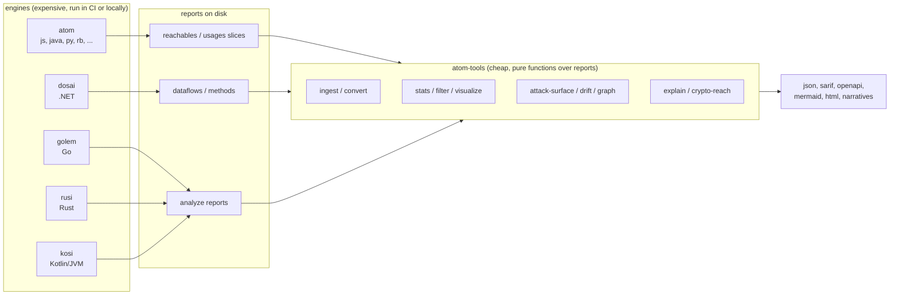

# Lesson 1: The ecosystem and where atom-tools fits

Before touching a command, you need the map. The AppThreat analysis ecosystem is a
set of independent engines, each of which reads a source tree or a binary and
writes a report about how data moves through it. atom-tools does not replace any
of them. It does everything after them: normalising, joining, filtering, drawing,
explaining and comparing the reports they leave behind.

## The five engines

**atom** slices Java, JavaScript, TypeScript, Python, Ruby, C, PHP, Scala and
friends. It writes the slice files this course is mostly about: reachables
(source-to-sink data flow paths), usages (how objects and methods are used) and
semantics. atom installs from a native image or with
`npm install -g @appthreat/atom`.

**dosai** analyses .NET. Its `dataflows` report carries nodes, edges, slices,
weakness candidates and an attack surface view; its `methods` report carries the
call graph, reachability and dead code. dosai is special in one way that will
matter in later lessons: it is the only engine that classifies authentication
outright.

**golem** discovers API endpoints and flows in Go projects. **rusi** does the same
for Rust. **kosi** does it for Kotlin and the JVM. All three are published in the
[cdxgen-plugins-bin](https://github.com/cdxgen/cdxgen-plugins-bin/releases)
releases and bundled in the atom-tools Docker image.

Every engine writes its own schema. A dosai dataflows report is a PascalCase
document with `Slices`, `Nodes` and `Edges`; a golem report is camelCase with
`endpoints` and `callGraph`; an atom reachables slice is a bare `{"reachables": [...]}`
document. atom-tools reads all of them, detects the engine from the report
envelope, and never asks you to translate by hand.

## The shape of the pipeline

The engines are the expensive part: each one parses, builds a graph and runs a
data flow solver. atom-tools is the cheap part: every command is a pure function
over report files, which is why most of them finish in seconds and are safe to
wedge into CI between build and test.

```text
             source tree                reports on disk                 deliverables
        .--------------------.      .--------------------.      .------------------------------.
        |  cdxgen (js)       |      | reachables.json    |      | stats, sarif, openapi, html  |
        |  petclinic (java)  | ---> | usages.json        | ---> | mermaid diagrams, narratives |
        |  eshop (dotnet)    |      | dosai dataflows    |      | drift deltas, gate verdicts  |
        |  ipsw (go)         |      | golem analyze      |      | unified flow model           |
        |  kafka-demo (rs)   |      | rusi analyze       |      '------------------------------'
        |  android (kt)      |      | kosi analyze       |                 ^
        '--------------------'      '--------------------'                  |
               ^                            ^                               |
               |                            '-------------------------------'
               |                                 read, never run
        +------+------+
        | atom-tools  |  (exceptions: analyze and apk-analysis, which drive
        +-------------+   an engine as a documented convenience)
```

In mermaid form, the same idea:



## The commands at a glance

Run `atom-tools list` and this is what you get (version 1.0.0 at the time of
writing):

```console
$ atom-tools list
Available commands:
  analyze          Analyse a source tree with atom and post-process the slices (merge, stats, OpenAPI, SARIF).
  apk-analysis     Analyse Android apps (apk/apkm/aab) using blint and atom.
  attack-surface   Group entry points by exposure tier and report what each reaches (dosai's AttackSurface view, for every engine).
  check-reachable  Find out if there are hits for a given package:version or file:linenumber in an atom slice.
  convert          Convert an atom slice to a different format.
  crypto-reach     Join crypto inventory (weak algorithms, key material, findings) to entry-point reachability, per engine, at the granularity each engine's evidence supports.
  drift            Compare two reachability reports from the same engine and report the risk delta between them (added, removed and moved flows).
  explain          Explain flows in words: deterministic, template-driven narratives over any engine report or unified document (text, markdown or agent JSON).
  filter           Filter an atom slice based on specified criteria.
  graph            Compute a call-graph metric (chokepoints, centrality, blast radius, entry depth, dead-code or cycles) over engine call graphs.
  help             Displays help for a command.
  ingest           Normalise dosai, golem, rusi, kosi or atom flow reports into the unified flow model (or an atom-compatible reachables document).
  list             Lists commands.
  merge-slices     Merge reachable slice files (including atom's chunked output) into a single de-duplicated slice.
  query-endpoints  List elements to display in the console.
  stats            Summarise an atom slice: counts, source files, packages (purls) and tags.
  validate-lines   Check the accuracy of the line numbers in an atom slice.
  visualize        Visualise reachable slices: rich console report plus a mermaid.js flowchart and an HTML page.
```

Two of those lines deserve a first reading now, because they set the tone for
everything else. The `graph` line says the metric is computed over engine call
graphs, and the `crypto-reach` line says the join runs "at the granularity each
engine's evidence supports". atom-tools treats an engine's verdict as evidence to
be quoted, not a signal to be smoothed over. When two engines support different
claims, the output says which claim it is making and for which engine. You will
meet this repeatedly: in the exposure tiers of `attack-surface`, in the "not
computed" versus "reaches nothing" distinction of the reach lines, in the
provenance labels of `graph`.

The command line interface itself is built with cleo, the same library that powers
Poetry, so the conventions carry over: `atom-tools help <command>` shows the
options of one command, `-q` silences everything but the result, `-v` through
`-vvv` increases verbosity.

## Why reports, why not just run the engine

Reading reports from disk keeps the engine toolchains and their failure modes out
of atom-tools' support surface, and it makes every command reproducible: the same
report file always produces the same output, which is what makes diffing in CI
meaningful. It also means the expensive step can run once, on whatever hardware
suits it, and every downstream question (a statistic, a diagram, a narrative, a
gate verdict) is answered from the artefact in seconds.

There is a working instance of this philosophy sitting in the cdxgen checkout you
cloned. The cdxgen repository root contains dosai reports from a real run
(`data-flow.slices.json`, `semantics.slices.json`, `usages.slices.json`). You can
already point atom-tools at one, before generating anything yourself:

```console
$ atom-tools stats -i ~/work/cdxgen/cdxgen/data-flow.slices.json
```

The engine is detected from the report envelope, in this case dosai, and the
summary prints. That is the whole model: file in, answer out.

## What you will generate in the next lesson

Lesson 2 runs the full loop on cdxgen as a JavaScript project: the atom engine
slices the tree, and atom-tools merges, counts and converts the result. Keep the
scratch directory from the course overview handy.

!!! note "Version note"
    The outputs in this course were captured with atom-tools 1.0.0. Exact counts
    and file names shift between versions and between cdxgen commits; the shapes
    and the reading of them are stable.
