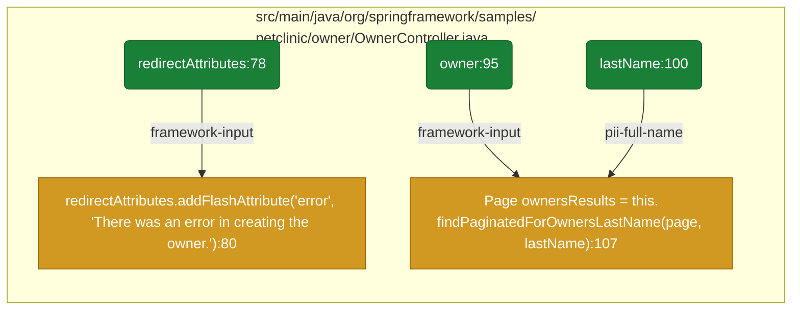

# Lesson 7: Visualize flows

The visualize command turns a reachables slice into things you can actually
share: a rich console report, a mermaid.js flowchart as a `.mmd` file, and a
single-file HTML page that renders it. With a CycloneDX SBOM passed alongside,
it also computes how many SBOM components the analysis proved reachable, which
turns the diagram into an SBOM reachability review.

## The console report

On the cdxgen reachables from lesson 2, with the SBOM cdxgen generated for
itself (yes, cdxgen analysing cdxgen; run `node bin/cdxgen.js -o sbom.cdx.json
--no-referenced` in the cdxgen checkout to reproduce it):

```console
$ atom-tools visualize -i cdxgen-reports/cdxgen.reachables.json \
      -b cdxgen-reports/sbom.cdx.json -o cdxgen-viz
╭──────────────────────────── Reachables overview ─────────────────────────────╮
│ Flow groups: 789   Files: 9   Sources: 789   Tagged flows: 789               │
│ Reachable packages: 0                                                        │
│ SBOM components: 7813   Proven reachable: 0 (0%)                             │
╰────────────────────────────────────────────────────────────────────────────╯
Data flows by file
├── lib/stages/postgen/introspection/score.js (191)
│   ├── _tmp_87:984 → substituteVersionPlaceholders(:567 [exported, 47 steps]
│   └── _tmp_87:984 → shapeCommand(resolved.command // '', (:588 [exported, 67 steps]
├── lib/cli/nativeBom.js (189)
│   ├── context:1526 → function createGoBom = async function createGoBom(path,
│   │   options) (:196 [framework-input, 25 steps]
│   └── ...
├── lib/cli/managedBom.js (136)
│   ├── context:1526 → function createPixiBom = function createPixiBom(path,
│   │   options) (:175 [framework-input, 24 steps]
│   └── ...
...
```

The overview panel is the honest headline: 789 flow groups across 9 files, and,
in bold numbers, "SBOM components: 7813, Proven reachable: 0 (0%)".

That zero deserves its own paragraph, because reading it wrong wastes an
afternoon. The SBOM join matches the purls carried by flow groups against SBOM
components. The cdxgen reachables from lesson 2 carry no purls, because the
babel-only frontend run made no dependency boundary resolution, so nothing can
match, and the honest rendering of "this analysis could not make that join" is
zero proven, not "zero percent of cdxgen's dependencies are used". The contrast
case follows below, where a slice that does carry purls proves 8 of 237 SBOM
components reachable.

## The mermaid diagram

The same invocation wrote `cdxgen-viz.mmd` and `cdxgen-viz.html`. The mermaid
file is plain text and diffable; the HTML loads mermaid.js from a CDN and
renders the diagram standalone (pass `--mermaid-source` with a local
`mermaid.min.js` for offline viewing). Renderers can be selected with `-f`:
`all` (default), `console`, `mermaid`, `html`.

The diagram styles sources green, high risk sinks red (`sql`, `ssrf`,
`code-execution` and friends), other tagged sinks orange, and package hexagons
purple carrying the license when an SBOM is given. Flows are grouped into
subgraphs by file and capped with `--max-flows`, keeping the most interesting
flows first. Labels carry the full relative path, sink expression and purl,
soft-wrapped rather than truncated; `--label-wrap 0` puts each on one line.

Here is the cdxgen diagram's opening, verbatim from `cdxgen-viz.mmd`:

```text
flowchart LR
    classDef source fill:#1a7f37,stroke:#116329,color:#fff
    classDef sinkHigh fill:#cf222e,stroke:#a40e26,color:#fff
    classDef sinkWarn fill:#d29922,stroke:#9a6700,color:#fff
    classDef pkg fill:#8250df,stroke:#5c33b8,color:#fff
    subgraph sg0["lib/stages/postgen/introspection/score.js"]
        n1("_tmp_87:984"):::source
        n2["substituteVersionPlaceholders(:567"]:::sinkWarn
        n1 -->|"exported"| n2
        n3["shapeCommand(resolved.command // '', (:588"]:::sinkWarn
        n1 -->|"exported"| n3
    end
```

## The purl-rich case: petclinic with an SBOM

The committed petclinic fixtures show the full feature set working, because
that reachables slice carries purls and the companion SBOM carries licenses.
Run from the atom-tools checkout:

```console
$ atom-tools visualize -i test/data/java-petclinic-reachables.json \
      -b test/data/java-petclinic-bom.json -o petclinic-viz --max-flows 12
╭──────────────────────────── Reachables overview ─────────────────────────────╮
│ Flow groups: 163   Files: 11   Sources: 78   Tagged flows: 78                │
│ Reachable packages: 8                                                        │
│ SBOM components: 237   Proven reachable: 8 (3%)                              │
╰────────────────────────────────────────────────────────────────────────────╯
Data flows by file
├── src/main/java/.../owner/OwnerController.java (73)
│   ├── redirectAttributes:78 → redirectAttributes.addFlashAttribute('error',
│   │   'There was an error in creating the owner.'):80 [framework-input, 3 steps]
│   │   via pkg:maven/org.springframework/spring-web@7.0.8
│   ├── owner:95 → Page ownersResults =
│   │   this.findPaginatedForOwnersLastName(page, lastName):107
│   │   [framework-input, 12 steps]
│   │   via pkg:maven/org.springframework.data/spring-data-commons@4.1.0
...
8 of 237 SBOM components (3%) are proven reachable.
```

And the diagram it wrote, rendered here directly (this is the actual
`petclinic-viz.mmd` content, trimmed to fit):



Read the edge labels as the taint reason: `framework-input` for framework-fed
parameters, `pii-full-name` when the source carries a person's name. That
`pii-full-name` edge is the kind of detail a reviewer scans diagrams for: a
form field, tagged as personal data, flowing into the paginated query.

## Chunked inputs and reachability review

visualize merges chunked reachable slices automatically (`reachables.json`,
`reachables_1.json`, ...) and accepts globs and comma-separated lists, so it can
run directly over atom's raw output directory. The package table at the bottom
of the console report lists every reachable package with its license and a
reachability marker when an SBOM was given, which is the artefact to attach to
a dependency review: "these 8 of our 237 components are proven reachable, here
is the flow evidence for each".

## Exercises

Run visualize on the cdxgen slice without `-b` and note exactly which numbers
change in the overview panel. Then run it on the juiceshop chunks with the
filter from lesson 5 applied first (`-p` package filter), and compare which
flows the diagram keeps under `--max-flows 20` versus 60.
